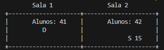
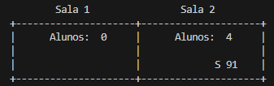
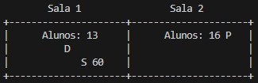

# MC504 - Projeto Multithread

---

## Tema: Room Party Problem

O problema proposto para solução neste projeto é chamado Room Party Problem. Ele se baseia na existência de uma sala na qual alunos podem se reunir para começar uma festa, entretanto o Diretor do colégio cuida para controlar se existe alguma festa ocorrendo nesta sala, podendo finalizar a festa e retirar todos os alunos de dentro da sala.

Os alunos e o diretor devem seguir algumas regras em especifíco:

- Qualquer número de alunos podem estar dentro de uma sala ao mesmo tempo.
- O diretor pode entrar na sala apenas se ela estiver vazia ou se existirem pelo menos 10% (Possível de alterar no código) do número de alunos total da escola dentro da sala.
- Se o diretor estiver dentro da sala, nenhum estudante pode entrar nesta sala.
- O diretor só deve deixar a sala que parou a festa quando todos os alunos tiverem saído da mesma.
- Existe apenas um diretor.

Como forma de complicar um pouco mais esse problema o grupo resolveu por adicionar mais de uma sala. Desta forma o diretor precisa escolher qual das duas salas pretende vasculhar enquanto os alunos escolhem em qual das duas salas querem entrar.

---

## Representação visual

Para facilitar a interação e compreensão do que está acontecendo, a visualização das atualizações de cada movimento aluno-diretor foi realizada por meio de desenhos em ASCII impresso constantemente pelo terminal.

> Neste exeplo a sala 1 está vazia, a sala 2 está com 3 alunos e o aluno reconhecido pelo RA 96 está saindo dela. Além disso, o Diretor está esperando para entrar na sala 2.

> Aqui a sala 1 ainda está vazia porém a sala 2 está com 4 alunos e o aluno reconhecido pelo RA 91 está saindo. Note que o diretor não está dentro de nenhuma sala e não está esperando para entrar.

> Aqui a sala 1 está com 13, o Diretor está dentro dela esvaziando, por isso o aluno RA 60 está saindo. Enquanto isso, a sala 2 está com 16 alunos dentro dela e uma festa está acontecendo (simbolizado pela letra P).

---

## Integrantes

- **Gabriel Vieira Sousa** -> 182891
- **Pedro Henrique Suguino** -> 187026
- **Giovani Lorenzo Bianchini** -> 186397

