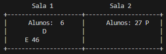
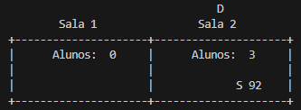

# MC504 - Projeto Multithread

---

## Tema: Room Party Problem

O problema proposto para solução neste projeto, chamado Room Party Problema. Ele baseia na existência de uma sala na qual alunos podem se reunir para começar uma festa, entretanto o Diretor do colégio cuida para controlar se existe alguma festa ocorrendo nesta sala, podendo finalizar a festa e retirar todos os alunos de dentro da sala.

Os alunos e o diretor devem seguir algumas regras em especifíco:

- Qualquer número de alunos podem estar dentro de uma sala ao mesmo tempo
- O diretor pode entrar na sala apenas se ela estiver vazia ou se existirem pelo menos 10% do número de alunos total da escola dentro da sala
- Se o diretor estiver dentro da sala, nenhum estudante pode entrar nesta sala
- O diretor só deve deixar a sala que parou a festa quando todos os alunos tiverem saído da mesma
- Existe apenas um diretor

Como forma de complicar um pouco mais esse problema o grupo resolveu por adicionar mais de uma sala. Desta forma o diretor precisa escolher qual das duas salas pretende vasculhar enquanto os alunos escolhem em qual das duas salas querem entrar.

---

## Representação visual

Para facilitar a interação e comprrensão do que está acontecendo a visuliazação das atualizações de cada movimento aluno-diretor foi realizada por meio de desenhos em ASCII impresso constantemente pelo terminal.

> Neste exemplo temos a Sala 1 com 36 alunos dentro dela, a Sala 2 com 33 alunos enquanto o Aluno reconhecido pelo RA 36 está saíndo da Sala 1

Note que o Diretor não aparece. Isso acontece porque ele não está executando nenhuma ação(esperando para entrar em alguma sala, dentro de alguma sala e etc.)

> Desta vez temos o aluno reconhecido pelo RA 15 saíndo da sala 2 enquanto isso o diretor está dentro da Sala 1.

---

## Integrantes

- **Gabriel Vieira Sousa** -> 182891
- **Pedro Henrique Suguino** -> 187026
- **Giovani Lorenzo Bianchini** -> 186397

